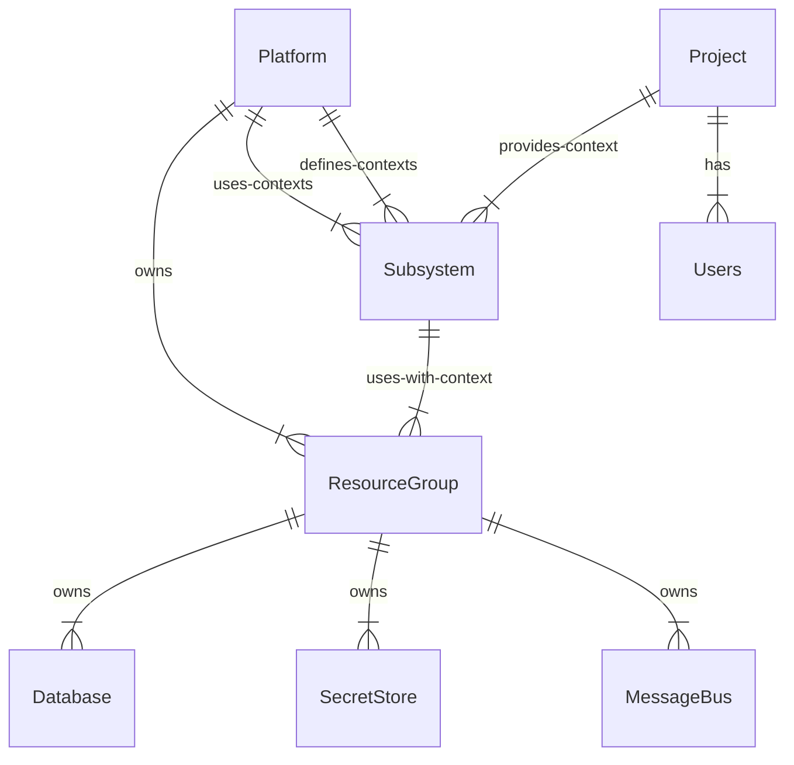

# Context

The model for resource ownership for the hoy cluster and services hosted in it.

resources are databases, users, infrastructure, message buses, etc

# Definition

The platform owns the resources and is ultimately responsible for their lifecycle.

The platform interacts with resources via subsystems once any bootstrapping is taken care off.

Because both platforms and projects interact with resources via the same path we get a consistent operations surface and target for rbac etc.

Platforms may use their "ownership" to accomplish things which can't be easily (or efficiently) accomplished via subsystems 

Projects can _only_ interact with resources by providing the necessary context.

Platforms create contexts for projects.

A context can be as simple as a prefix for a database table name or redis key space

Platform infra will need to be developer aware.

Developers get the context info from terraform state for their projects.